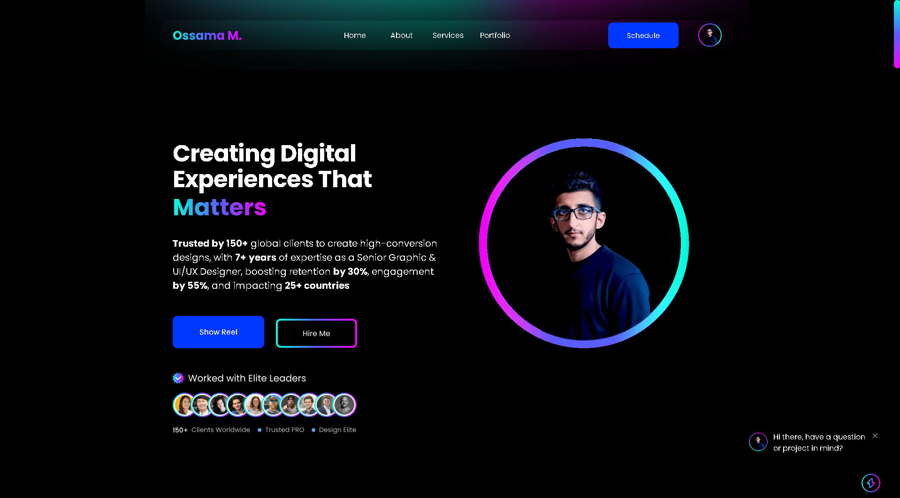

<!--- assets are created on Canva --->
<!--- Feel free to download the assets and use them in your profile --->
<!--- to upload an asset, create an issue on any of your repositories and add files, the link will be generated --->

<!--- animated text, to copy, just replace the lines with your choice or visit https://readme-typing-svg.herokuapp.com --->
  
<!---

[;User+Experience+(UX))](https://git.io/typing-svg)

--->
  
<!--- header image --->

  

  

  
<!--- portfolio launch image --->
  

  
<!--- social media icons, you can find them in the assets directory of this repo --->
  
  
  
  
  
 
  

  

  

  

  
<!--- a bit of vertical space & languages text --->
  

&nbsp;

  

  
  
<!--- language icons --->
  
  
<!--- 

 
--->
  
  

  
  
&nbsp;
<h1 align="center">
  ABOUT ME
</h1>
  

  
Started my career at the age of Sixteen (16) as a Graphic Designer. I have four (4) plus years of predominant hands-on experience gained by doing freelance on different platforms🎉.

✔ Currently specialized in working as a Senior Graphic Designer, Brand Identity Strategist, and Visual Identity designer 🚀

✔ Around 𝟏𝟎𝟎+ Projects accomplished as a Graphic Designer throughout my freelance journey ♾

✔ 𝟏𝟎𝟎% Job Success Score - More than 100 scenes modeled with Upwork clients 🎉

✔ 𝐓𝐎𝐏-𝐑𝐀𝐓𝐄𝐃 Freelancer Acknowledgement from Upwork ⛷️

✔ Maintain the feedback (𝟝.𝟘/𝟝) - More than 9𝟎% of clients recommended 🎩

✔ Respond quickly to clients, and get the work done promptly 🎮
  
  <!--- Personal --->  
  
<h1 align="center">
    Personal 
    </h2>

Fantasy Fulfilled `Insha-Allah` Dreamy leads to `Allahamdullah`.
  
Building `Elegant` Open Source Repository and Projects.
  
Bloodline `Creative, Reflective & Introspective` Designer.
  
Aspire `Broke` those with `Excellence` who try to mess up `Soft Heart`.
  
Smarting `Ignorance/absence` those who lose diamond.
  
Believe `in Allah Almighty` Exclusively and Unconditionally.
  
  
  <!--- Education --->  
  
<h1 align="center">
    Education 
    </h2>

  Eight Semester - `Bachelor` in `Software Engineering `(BSSE)` - Comsats University Islamabad
  
  `Intermediate` in `Computer Science` `(ICS)` - Punjab Group of College's 
  
  `Secondary School` Certificate `(SSC)` or `Matriculation` Examination - Islamabad Model College For Boys

  
  <!--- Portfolio/Website --->  
  
<h1 align="center">
    Portfolio/Website
    </h2>
  
  `Personal Website` -> <a href="https://ossamamehmood.github.io" target="_blank">`Ossama Mehmood`</a>
  
  `Behance (Portfolio)` -> <a href="https://www.behance.net/ossamamehmood" target="_blank">`Ossama Mehmood`</a>

  `Figma (UI/UX)` -> <a href="https://www.figma.com/@ossamamehmood" target="_blank">`Ossama Mehmood`</a>
  
  `Linktree` -> <a href="https://linktr.ee/ossamamehmood" target="_blank">`Ossama Mehmood`</a>
  
  
  <!--- Buy Me a Coffee ☕ ---> 
  
<!--- <h3 align="center"></h3>

 --->

  
  <!--- adding 3D earth icon to show some love for the environment 🌏 --->
  

  

  
  
  
  
  

<!--- Recent Activity ☂️ ---> 

<h1 align="center">
    Recent Activity ☂️
    </h2>

<table align="center">
  <tr> 
    

    <td align="left">
      
<!--START_SECTION:activity-->
1. 🔒 Closed issue [#5908](https://github.com/ossamamehmood/Hacktoberfest2023/issues/5908) in [ossamamehmood/Hacktoberfest2023](https://github.com/ossamamehmood/Hacktoberfest2023)
2. 🔒 Closed issue [#5900](https://github.com/ossamamehmood/Hacktoberfest2023/issues/5900) in [ossamamehmood/Hacktoberfest2023](https://github.com/ossamamehmood/Hacktoberfest2023)
3. 🔒 Closed issue [#5896](https://github.com/ossamamehmood/Hacktoberfest2023/issues/5896) in [ossamamehmood/Hacktoberfest2023](https://github.com/ossamamehmood/Hacktoberfest2023)
4. 🔒 Closed issue [#5914](https://github.com/ossamamehmood/Hacktoberfest2023/issues/5914) in [ossamamehmood/Hacktoberfest2023](https://github.com/ossamamehmood/Hacktoberfest2023)
5. 🔒 Closed issue [#5889](https://github.com/ossamamehmood/Hacktoberfest2023/issues/5889) in [ossamamehmood/Hacktoberfest2023](https://github.com/ossamamehmood/Hacktoberfest2023)
6. 🔒 Closed issue [#5887](https://github.com/ossamamehmood/Hacktoberfest2023/issues/5887) in [ossamamehmood/Hacktoberfest2023](https://github.com/ossamamehmood/Hacktoberfest2023)
7. 🔒 Closed issue [#5886](https://github.com/ossamamehmood/Hacktoberfest2023/issues/5886) in [ossamamehmood/Hacktoberfest2023](https://github.com/ossamamehmood/Hacktoberfest2023)
8. 🔒 Closed issue [#5917](https://github.com/ossamamehmood/Hacktoberfest2023/issues/5917) in [ossamamehmood/Hacktoberfest2023](https://github.com/ossamamehmood/Hacktoberfest2023)
<!--END_SECTION:activity-->

 </td>
   

  </tr>
</table>

<!--- Github snack contribution graph --->
  

 

<!--- building footer with spaceship question --->
  

  
 

